<h1>Part 1. Получение метрик и логов</h1>

Задание

- Использовать Docker Swarm из первого проекта

Взяла конфиги из проекта 07 и переписала их по новому заданию

- Написать при помощи библиотеки Micrometer сборщики следующих метрик приложения:
    * количество отправленных сообщений в rabbitmq;
    * количество обработанных сообщений в rabbitmq;
    * количество бронирований;
    * количество полученных запросов на gateway;
    * количество полученных запросов на авторизацию пользователей.

Запушила пересобранные образы

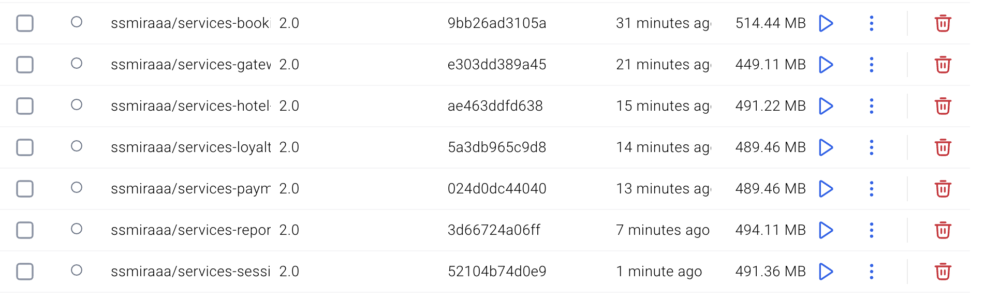

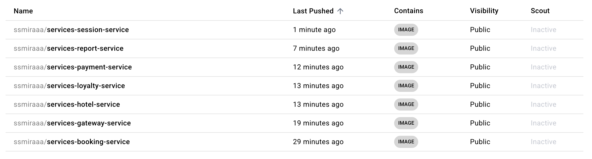

- Добавить логи приложения с помощью Loki.

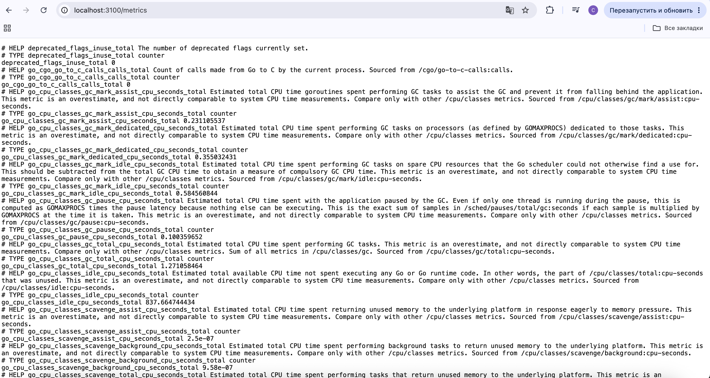

- Создать новый стек для Docker Swarm из сервисов с Prometheus Server, Loki, node_exporter, blackbox_exporter, cAdvisor. Проверить получение метрик на порту 9090 через браузер.

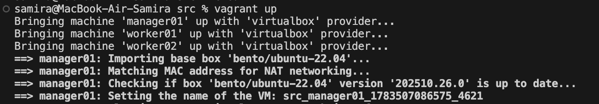

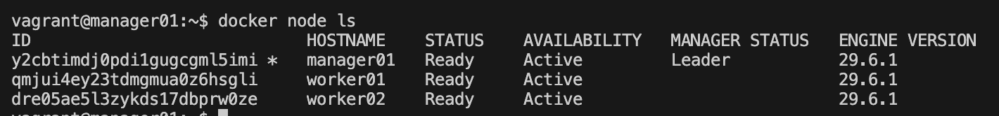

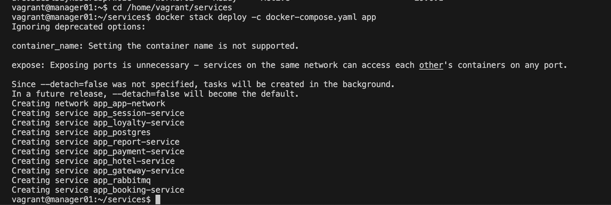

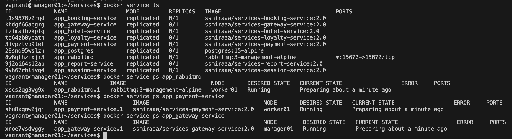

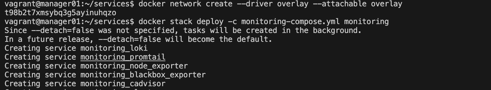

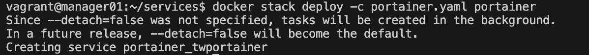

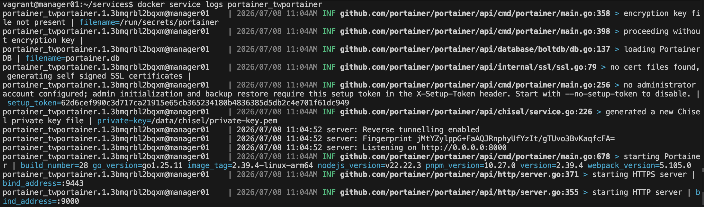

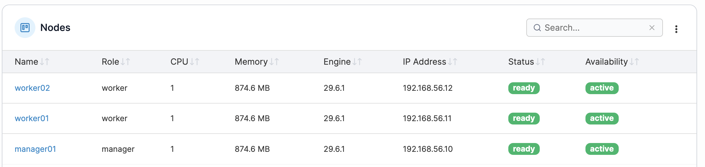

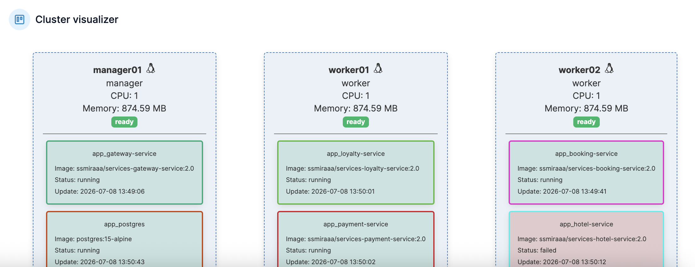

