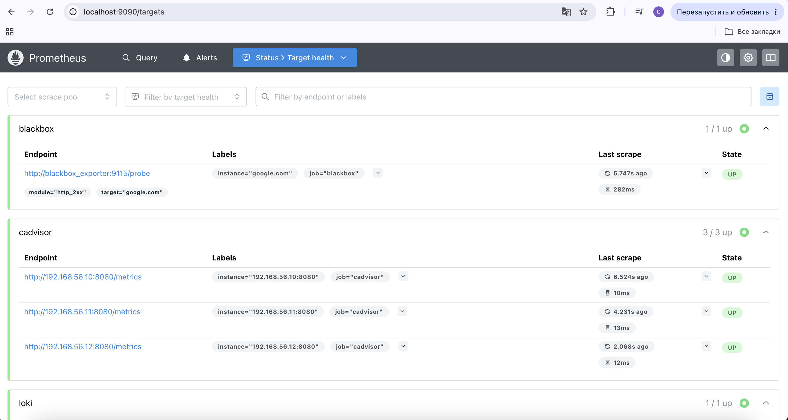
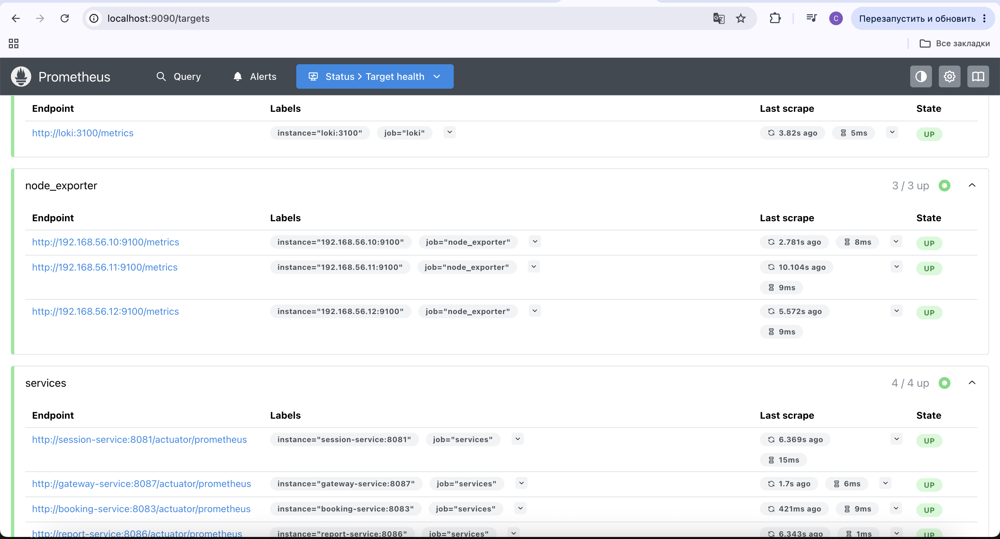
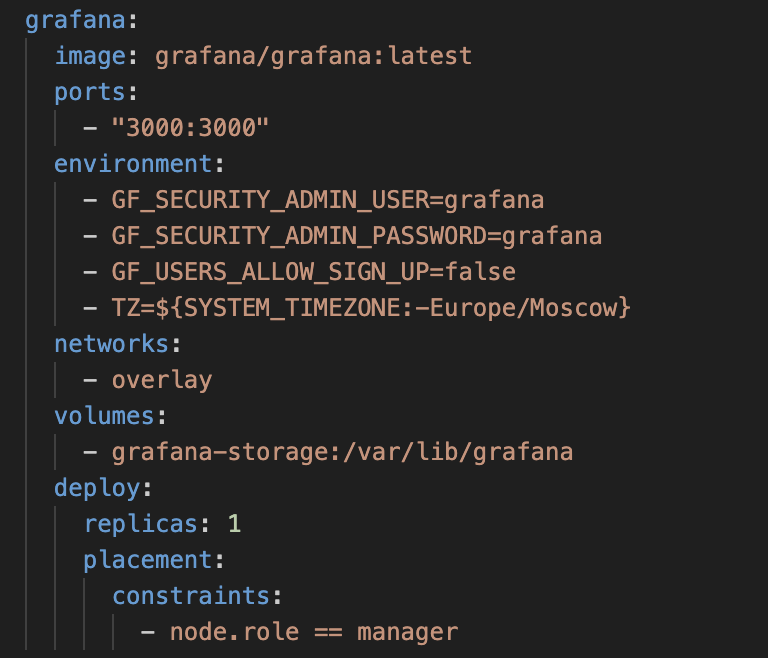
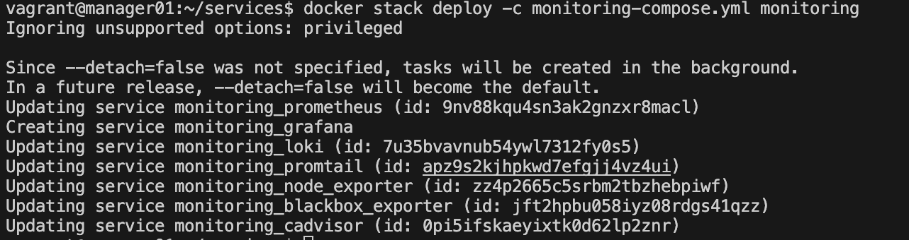
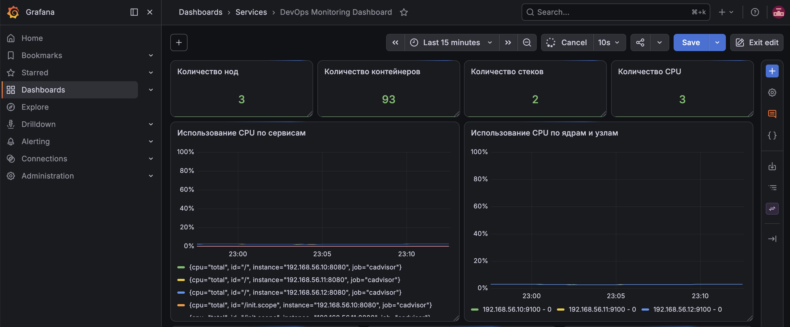
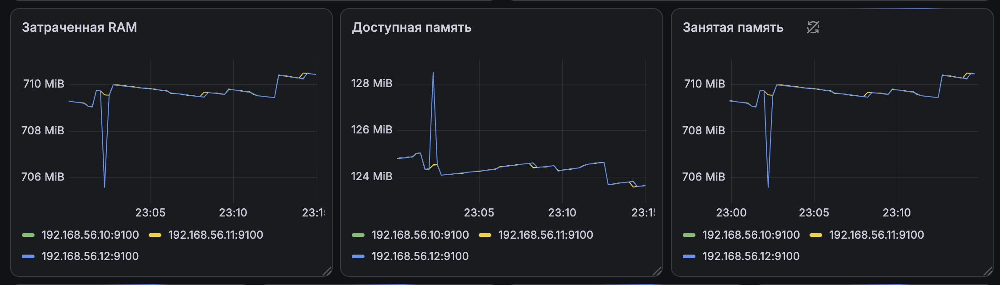
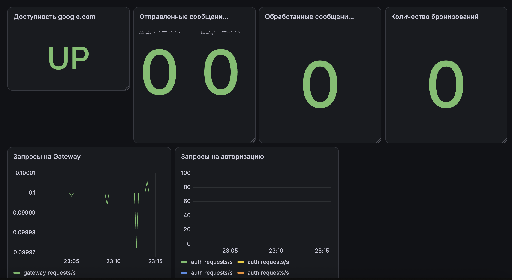

<h1>Part 1. Получение метрик и логов</h1>

Задание

- Использовать Docker Swarm из первого проекта

Взяла конфиги из проекта 07 и переписала их по новому заданию

- Написать при помощи библиотеки Micrometer сборщики следующих метрик приложения:
    * количество отправленных сообщений в rabbitmq;
    * количество обработанных сообщений в rabbitmq;
    * количество бронирований;
    * количество полученных запросов на gateway;
    * количество полученных запросов на авторизацию пользователей.

Запушила пересобранные образы

- Добавить логи приложения с помощью Loki.

- Создать новый стек для Docker Swarm из сервисов с Prometheus Server, Loki, node_exporter, blackbox_exporter, cAdvisor. Проверить получение метрик на порту 9090 через браузер.

<h1>Part 2. Визуализация</h1>

Задание

- Развернуть grafana как новый сервис в стеке мониторинга

- Добавить в Grafana дашборд со следующими метриками:

    * количество нод;
    * количество контейнеров;
    * количество стеков;
    * использование CPU по сервисам;
    * использование CPU по ядрам и узлам;
    * затраченная RAM;
    * доступная и занятая память;
    * количество CPU;
    * доступность google.com;
    * количество отправленных сообщений в rabbitmq;
    * количество обработанных сообщений в rabbitmq;
    * количество бронирований;
    * количество полученных запросов на gateway;
    * количество полученных запросов на авторизацию пользователей;
    * логи приложения.

<h1>Part 3. Отслеживание критических событий</h1>

Задание

- Развернуть Alert Manager как новый сервис в стеке монтиторинга

- Добавить следующие критические события:

    * доступная память меньше 100 Мб;
    * затраченная RAM больше 1 Гб;
    * использование CPU по сервису превышает 10%.

- Настроить получение оповещений через личные email и Телеграм.

